# 📊 Customer Churn Prediction

### End-to-End Machine Learning Pipeline for Customer Retention Analysis

<p align="center">


</p>

<p align="center">

<b>Machine Learning project for predicting customer churn in the telecommunications industry.</b>

Developed as an end-to-end Data Science pipeline covering data preparation, feature engineering, model training, evaluation, and visualization.

</p>

---

# 📌 Overview

Customer churn is one of the biggest challenges for subscription-based companies.

Acquiring a new customer is considerably more expensive than retaining an existing one, making churn prediction a valuable business application.

This project implements a complete **Machine Learning pipeline** using the **IBM Telco Customer Churn** dataset to identify customers at high risk of cancellation.

The project was designed following real-world Data Science practices, from data preprocessing to comparative evaluation of multiple machine learning algorithms.

---

# 🎯 Objectives

- Predict customer churn
- Compare multiple machine learning models
- Perform Exploratory Data Analysis (EDA)
- Engineer informative features
- Evaluate models using multiple classification metrics
- Produce publication-quality visualizations

---

# 🧠 Machine Learning Pipeline

```text
                    IBM Telco Customer Churn Dataset
                                   │
                                   ▼
                        Data Cleaning & Validation
                                   │
                                   ▼
                     Exploratory Data Analysis (EDA)
                                   │
                                   ▼
                         Feature Engineering
                                   │
                                   ▼
                  Label Encoding + One-Hot Encoding
                                   │
                                   ▼
                           Feature Scaling
                                   │
                                   ▼
        ┌─────────────────────────────────────────────────────┐
        │ Logistic Regression │ Random Forest │ XGBoost │ LGBM│
        └─────────────────────────────────────────────────────┘
                                   │
                                   ▼
                     Comparative Model Evaluation
                                   │
                                   ▼
ROC Curves • Precision-Recall Curves • Confusion Matrices • Feature Importance
```

---

# 📊 Dataset

**IBM Telco Customer Churn Dataset**

| Feature | Description |
|----------|-------------|
| Customers | 7,043 |
| Features | Demographic, contract, billing and service information |
| Target | Customer Churn |
| Task | Binary Classification |

---

# ⚙️ Feature Engineering

Several additional variables were created to improve predictive performance.

| Feature | Description |
|----------|-------------|
| TenureGroup | Customer lifetime category |
| NumServices | Number of subscribed services |
| AvgMonthlySpend | Average monthly spending |
| IsNewHighValue | High-value new customers |
| HasInternetNoProtection | Internet users without protection services |
| MonthToMonthElectronicCheck | High-risk contract/payment combination |

---

# 🤖 Models

| Model | Description |
|--------|-------------|
| Logistic Regression | Linear baseline classifier |
| Random Forest | Ensemble of decision trees |
| XGBoost | Gradient Boosting |
| LightGBM | Histogram-based Gradient Boosting |

---

# 📈 Evaluation Metrics

The models are evaluated using multiple performance metrics.

| Metric | Purpose |
|----------|----------|
| Accuracy | Overall performance |
| Precision | False positive control |
| Recall | Churn detection capability |
| F1-score | Precision/Recall balance |
| ROC-AUC | Ranking performance |
| PR-AUC | Performance on imbalanced data |

---

# 📷 Visualizations

The project automatically generates several visualizations.

## 📊 Exploratory Data Analysis

<p align="center">
  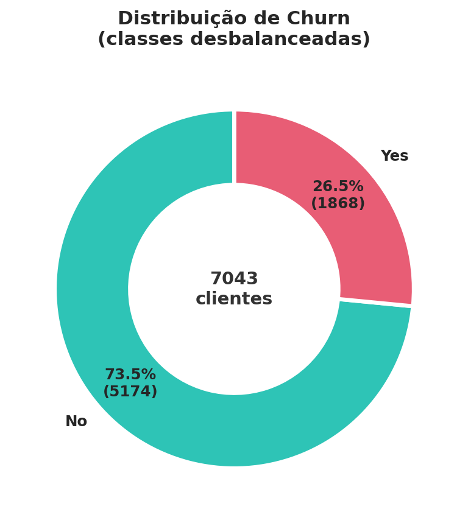
  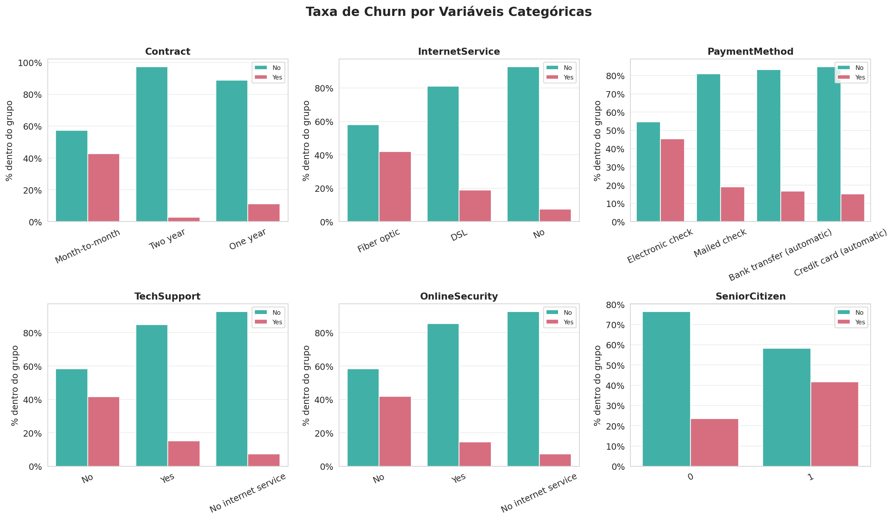
</p>

<p align="center">
  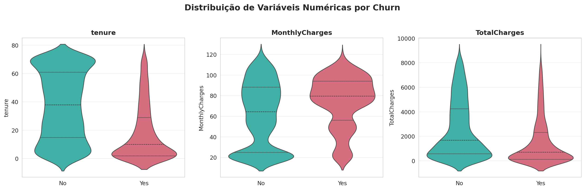
  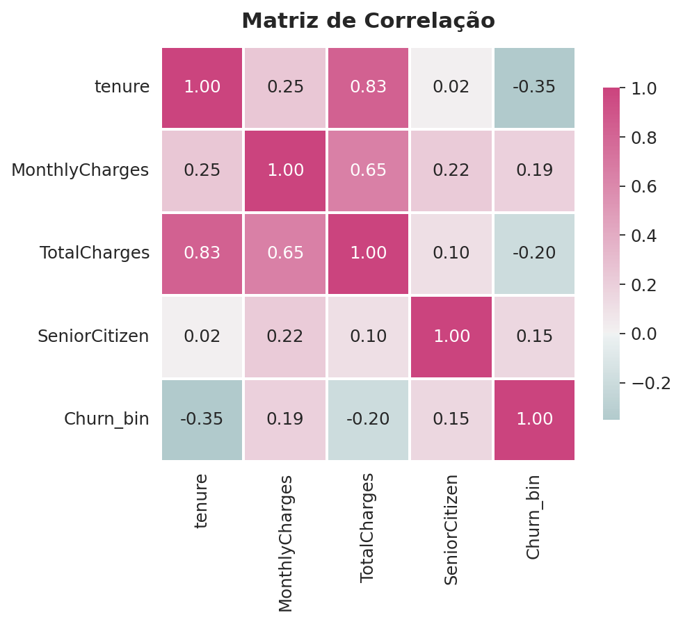
</p>

<p align="center">
  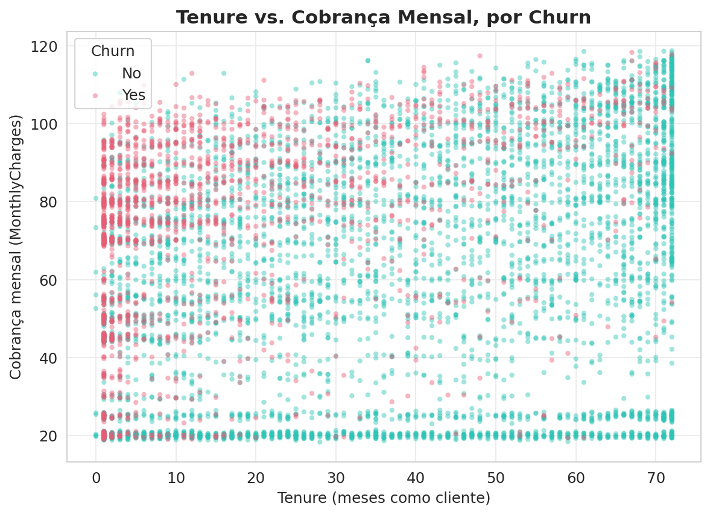
</p>

---

## 📈 Model Evaluation

<p align="center">
  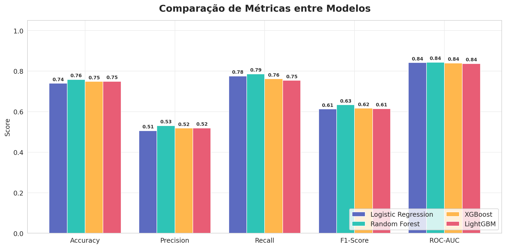
  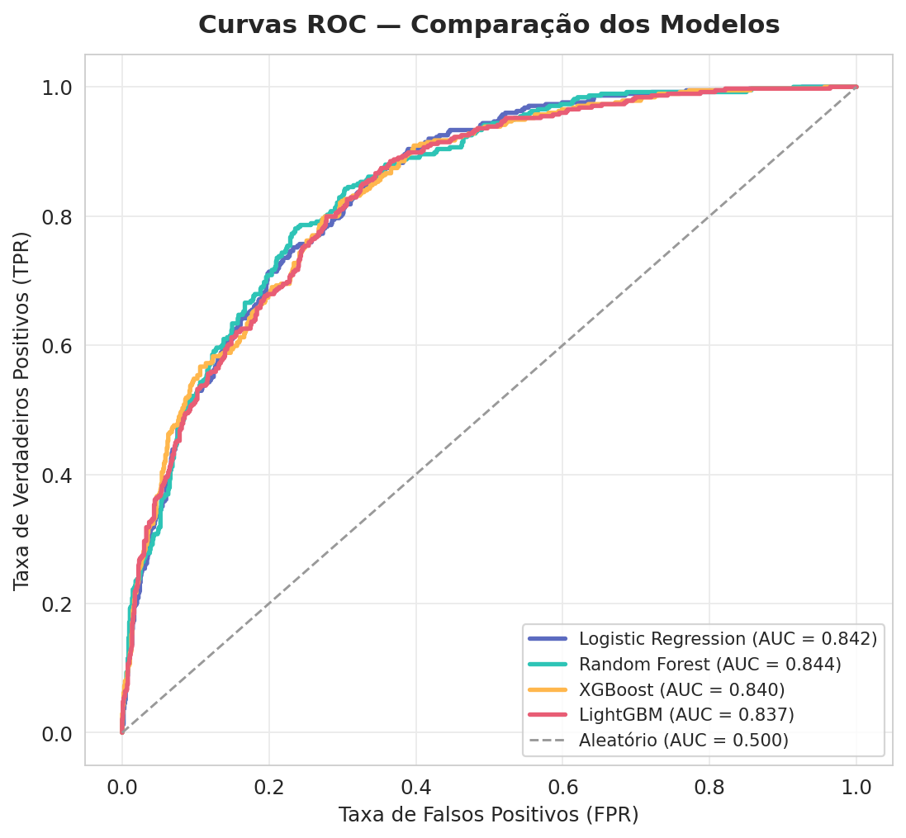
</p>

<p align="center">
  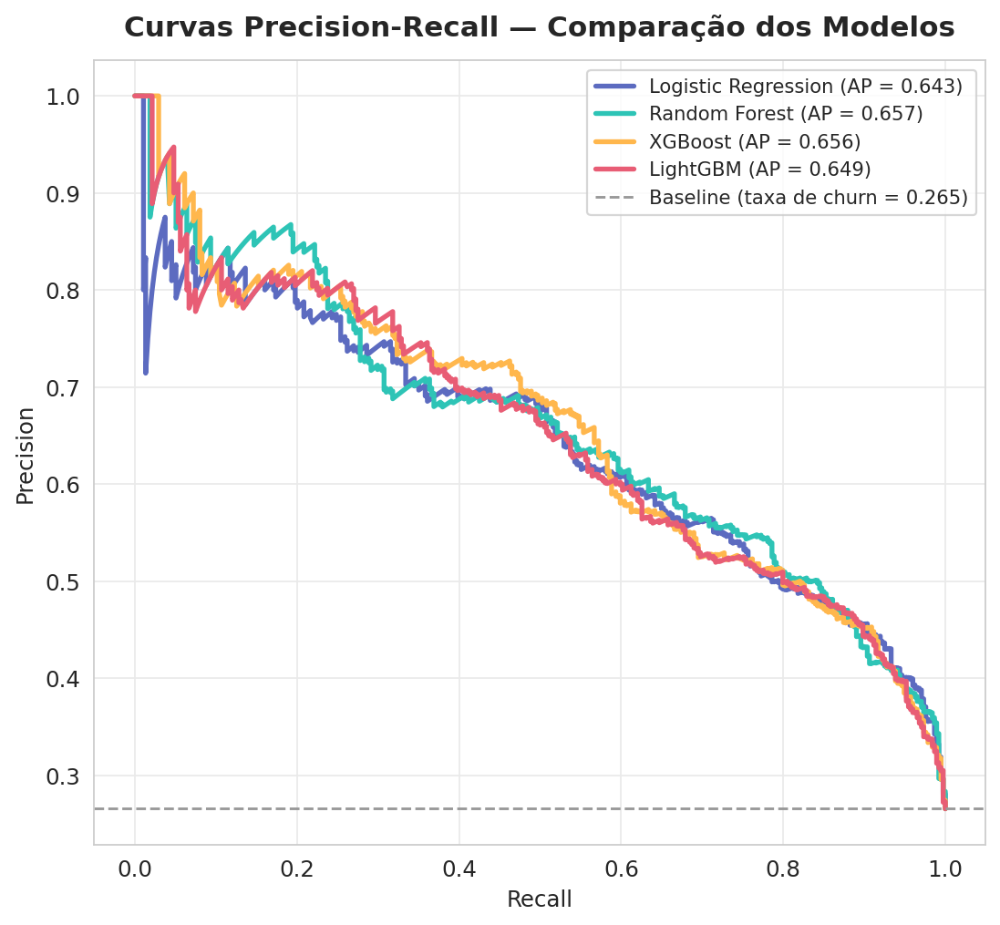
  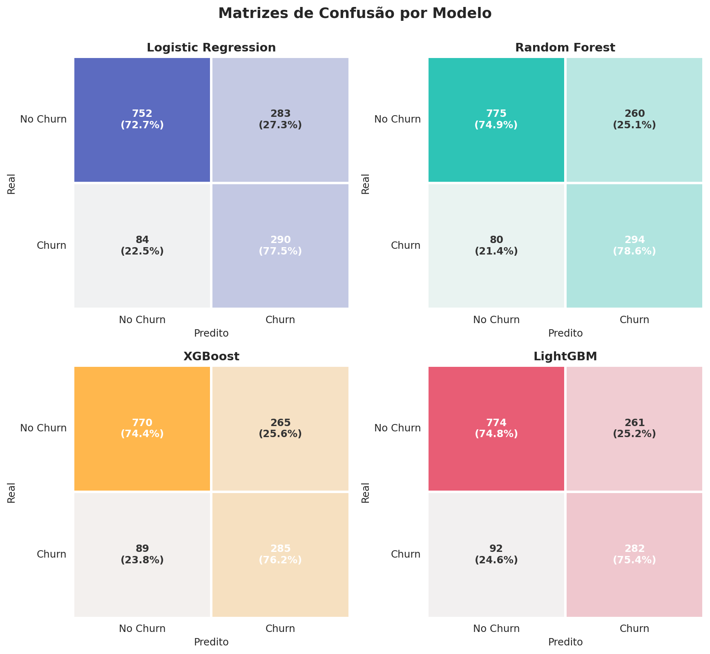
</p>

<p align="center">
  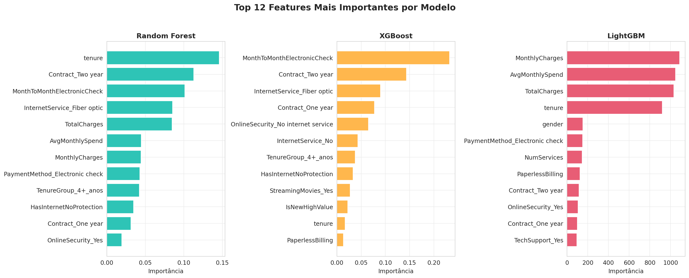
  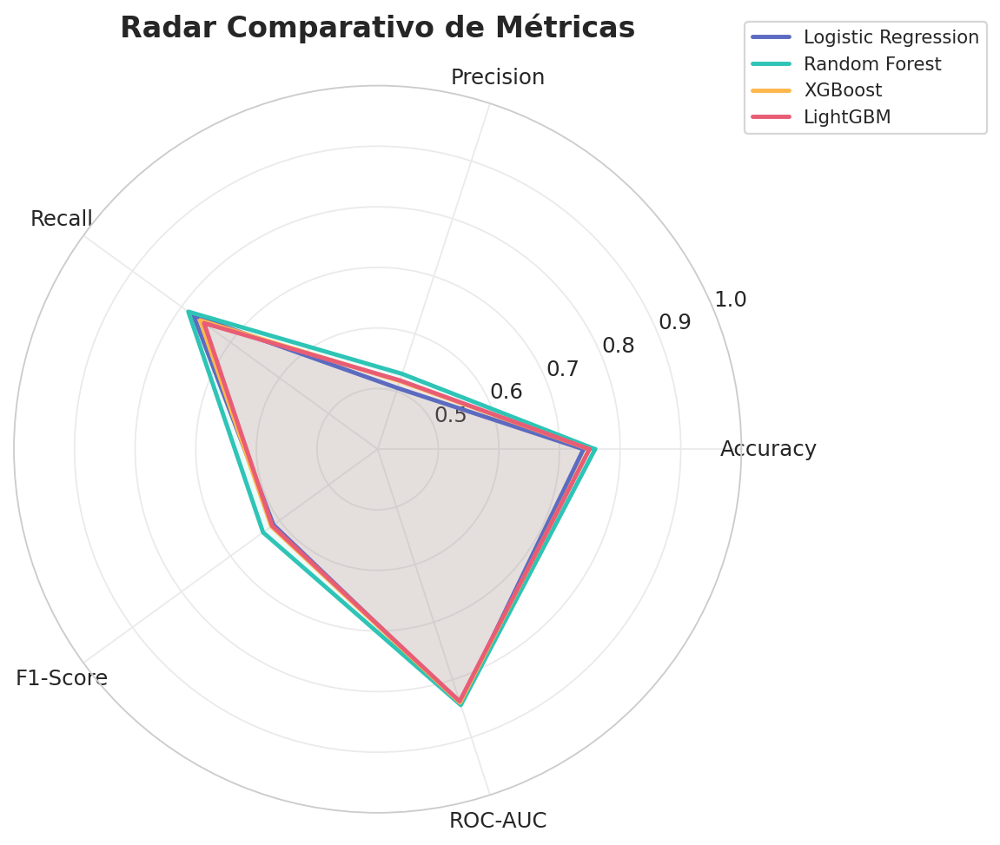
</p>

---

# 📂 Repository Structure

```text
customer-churn-prediction/

│

├── README.md

├── LICENSE

├── requirements.txt

├── churn_prediction.py

├── metrics_comparison.csv

├── figures/

├── models/

└── notebooks/
```

---

# 🚀 Installation

Clone the repository

```bash
git clone https://github.com/YOUR_USERNAME/customer-churn-prediction.git
```

Install dependencies

```bash
pip install -r requirements.txt
```

Run

```bash
python churn_prediction.py
```

---

# 🛠 Technologies

- Python
- Pandas
- NumPy
- Matplotlib
- Seaborn
- Scikit-Learn
- XGBoost
- LightGBM

---

# 📌 Highlights

✅ End-to-End Data Science Pipeline

✅ Data Cleaning

✅ Exploratory Data Analysis

✅ Feature Engineering

✅ Feature Scaling

✅ Four Machine Learning Models

✅ Comparative Evaluation

✅ Publication-quality Figures

✅ Automatic Metrics Comparison

---

# 🔮 Future Improvements

- Hyperparameter Optimization (Optuna)
- SHAP Explainability
- Streamlit Dashboard
- FastAPI API
- Docker Deployment
- MLflow Integration
- Automated Unit Tests
- CI/CD with GitHub Actions

---

# 📚 References

IBM Telco Customer Churn Dataset

Scikit-Learn Documentation

XGBoost Documentation

LightGBM Documentation

---

# 👨‍💻 Author

**Vinícius Nunes Leal**

Physicist | Scientist Researcher
